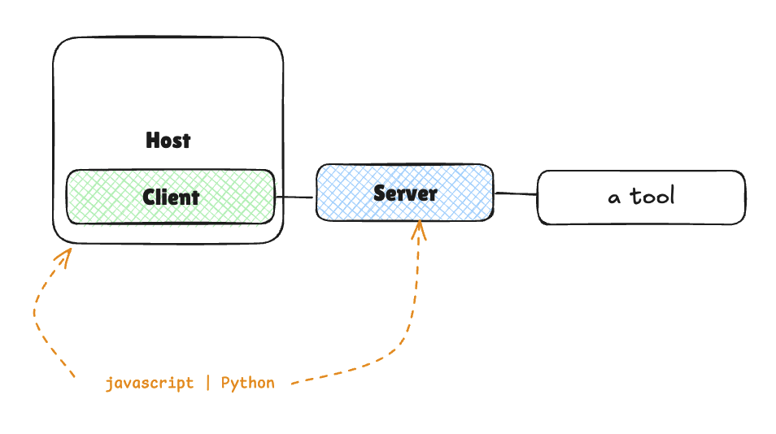

# mcp-sentiment-analysis
sentiment analysis application 

### We’ll build a sentiment analysis application that consists of three main parts: the server, the client, and the deployment.

Server Side:

* Uses Gradio to create a web interface and MCP server via gr.Interface
* Implement a sentiment analysis tool using TextBlob
* Exposes the tool through HTTP and MCP protocols

Client Side:

* Implements a HuggingFace.js client
* Or, Creates a smolagents Python Client
* Demonstrates how to use the same server with different client implementations

Deployment:
* Deploys the server to Hugging Face Spaces
* Configures the clients to work with the deployed server

Building the Gradio MCP Server
* create our sentiment analysis MCP server using Gradio. This server will expose a sentiment analysis tool that can be used by both human users through a web interface and AI models through the MCP protocol.

Introduction to Gradio MCP Integration

Gradio provides a straightforward way to create MCP servers by automatically converting your Python functions into MCP tools. When you set mcp_server=True in launch(), Gradio:

* Automatically converts your functions into MCP Tools
* Maps input components to tool argument schemas
* Determines response formats from output components
* Sets up JSON-RPC over HTTP+SSE for client-server communication
* Creates both a web interface and an MCP server endpoint
